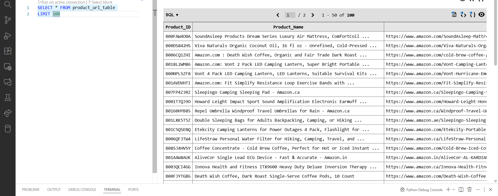

# Amazon_Scrape_Flow_ID2URL

ETL pipeline that enriches a public Amazon review dataset by adding corresponding product URLs to extracted top-rated product IDs.

This project demonstrates a simple ETL (Extract, Transform, Load) pipeline that processes **Amazon Customer Review Data** to identify and display the **top 10000 products with the highest 5-star ratings**. 

In addition, the pipeline **enriches the dataset** by mapping product IDs to their corresponding Amazon product URLs.
This is done by:

- Using the product ID from the dataset.
- Searching the internet using the Python requests module, USER AGENTS and a helper function for links that contain the product ID. 
- Selecting only URLs that:
  - Are associated with **www.amazon.**.
  - End with or contain the exact product ID or the parent product ID.
- Retrieves the product name associated with the URL.
- Stores both the URL and product name to the augmented dataset.

The resulting enriched dataset allows you to directly access the product pages for the top-rated items.

## Example

Product ID in dataset:

```bash
B0CJZMP7L1
```

Enriched data added:

```bash
Product_Name: Stanley Quencher H2.0 Tumbler with Handle and Straw 30 oz | Flowstate 3 ...
URL: https://www.amazon.ca/Stanley-Quencher-FlowState-Stainless-Insulated/dp/B0CJZMP7L1
```

The goal is to showcase how data can be fetched, cleaned, processed, and stored to derive actionable business insights.

## Ultimate Business Purpose

The ultimate purpose of this pipeline is to **identify and list the top 10000 products** with the **highest frequency of 5-star ratings** from the **Amazon Customer Reviews** dataset. This can help businesses identify their **best-performing products**, allowing for better decision-making, targeted marketing, and product strategy.

## Table of Contents
1. [Project Overview](#project-overview)
2. [Technology Stack](#technology-stack)
3. [Dataset Description](#dataset-description)
---

## Project Overview
The ETL pipeline will:
1. **Extract**: Load data from Hugging Face's `Amazon Customer Review` dataset.
2. **Transform**: Filter out products with a 5-star rating and count how many times each product (ASIN) has received a 5-star review, augment with URLs/product names from the web.
3. **Load**: Schema creation (tables, data types, PKs, FKs), Store the data in a **DuckDB database**.
4. **POST-processing and Reporting**: After processing, the top 10000 products with the highest number of 5-star reviews, their product names and urls  will be stored into a new table for analysis.
---

## Technology Stack
- **Python**: Programming language for data extraction, transformation, and loading.
- **Hugging Face `datasets` library**: For loading and caching the Amazon Customer Review dataset.
- **DuckDB**: An in-process analytical database optimized for fast OLAP-style queries on large datasets; used for storage.
- **Pandas**: Used to export analyticl query results to Excel files, a bridge between DuckDB data and spreadsheet output.
- **Requests**: For parsing HTML and extracting targeted webpage data.
---

## Dataset Description
The **Amazon Customer Review** dataset contains product reviews, with attributes such as:
- **`asin`**: The unique identifier for each product.
- **`star_rating`**: The star rating given by the customer (ranging from 1 to 5 stars).

The data used is extracted from **Hugging Face**, and it includes review data for various products on Amazon. 
This dataset is a subset of [HuggingFace kevykibbz Dataset](https://huggingface.co/datasets/kevykibbz/Amazon_Customer_Review_2023).

Sample Record :
```
{"rating": 5, "title": "Excellent!", "text": "I love it. Pretty!", "images": [], "asin": "B00NXQLFQQ", "parent_asin": "B00NXQLFQQ", "user_id": "AFKZENTNBQ7A7V7UXW5JJI6UGRYQ", "timestamp": 1.52309e+12, "helpful_vote": 0, "verified_purchase": true}
```
The dataset is typically split into `train` and `test` splits, and the `train` split is used for this project.

## Steps in the Pipeline

1. **Download and Cache the Dataset**:
   - Use the `load_dataset` function from Hugging Face's `datasets` library to fetch the Amazon Customer Review dataset.
   - Cache the dataset to avoid repeated downloads. 
   DatasetDict({
    train: Dataset({
        features: ['rating', 'title', 'text', 'images', 'asin', 'parent_asin', 'user_id', 'timestamp', 'helpful_vote', 'verified_purchase'],
        num_rows: 33913690
    })
})
Number of rows in the 'train' split: 33913690
Number of rows in the dataset: 33913690

2. **Transform the Data**:
   - Filter the dataset to only include reviews with a **5-star rating** verified purchases==True.
   - Remove duplicates and records with null product IDs.
   - Clean up text by converting to lowercase and removing extra spaces in columns title and text.
   - Converted the Unix timestamp to a readable datetime format.
   - Group the data by the **`asin` (product ID)** and count the occurrences of 5-star reviews for each product.

3. **Load Data into DuckDB**:
   - Store the cleaned data into an **DuckDB database** preserving all columns.
   - Create a table in SQLite with two columns: `asin` and `five_star_count`.

4. **Post-Processing: Display the Top 10000 Products and store in table**:
   - Query the table in database to retrieve the top 10000 products based on the highest count of 5-star ratings.
   - Display the results.
   - Created a top product count table to store retrieved data.
   - Retrieved product URLs and product names by querying the web using the asin values from the top products table, then populated the corresponding asin entries in the table with the retrieved data.

## Running the Pipeline

### Step 1: Install Dependencies

Make sure to install the required Python libraries by running:

```bash
pip install -r requirements.txt
```

### Step 2: Run the ETL Script
After installing the dependencies, you can run the etl_main.py script to process the data, load it into an DuckDB database, and retrieve the top 10000 products.

Run the script using:

```bash
python etl_main.py
```

This will
- Download and cache the dataset.
- Filter the data to keep only 5-star ratings.
- Load the data into the amazon_sales_db.duckdb database.
- Query and display the top 10000 products with the most 5-star reviews along with their amazon links.

### Step 3: View the Results
The top 10000 products will be displayed in the console and also spooled to an excel file, showing the asin (product ID), their links and the count of 5-star reviews for each product.

## Database Tables
<figure>
    <figcaption>Product Table</figcaption>
        
</figure>

## Conclusion
This project can be useful for businesses to:
- Highlight the best products in marketing or advertising.
- Analyze customer satisfaction and identify their most popular items.
- Make data-driven decisions based on customer feedback.
